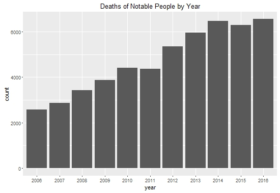
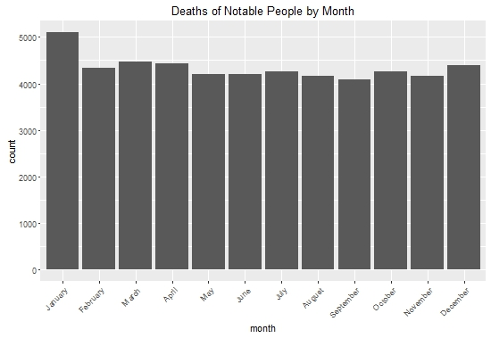

On top of 2016 being a bit of a dumpster fire of a year in general,
doesn't it seem like a lot of famous people have died in 2016? I set out
to find out if that's true or just my perception. (Also I needed to
learn how to use the Rvest package for another project and while I was
waiting for the details on that project, I decided to use this as an
experiment to play around with it.)

Part One: Notable Deaths By Year
--------------------------------

I used Wikipedia's lists of deaths of notable people from 2006 to
present. After discarding incomplete data, this left me with 52,101
people.

As you can see, 2016 *does* in fact have the most deaths, with 6,553
notable people having died so far. In fact, I ran this analysis on
December 28, and even with three more days before this year ends, we've
already beaten 2014, the next highest year, by 75 deaths. 38% more
notable people have died this year than the annual average over this
11-year period, which is 4,736.

Now, before we all start freaking out about this death rate, it should
be noted that the higher number of deaths in 2016 may not actually
reflect more people actually dying - it may simply be that more deaths
are being recorded on Wikipedia. The fairly steady increase and the
relatively low number of deaths reported in 2006 (when Wikipedia was
only five years old) suggests that this is probably the case.

By the way, in case you were wondering what the deadliest month is for
notable pepole, it's January.

So we now know that in fact more notable people did die in 2016 than
usual. I think another reason 2016 seems so awful is that many *very*
famous people died this year. In the second part of my analysis (coming
soon), I'll calculate a "fame index" to look at whether this is in fact
true.
